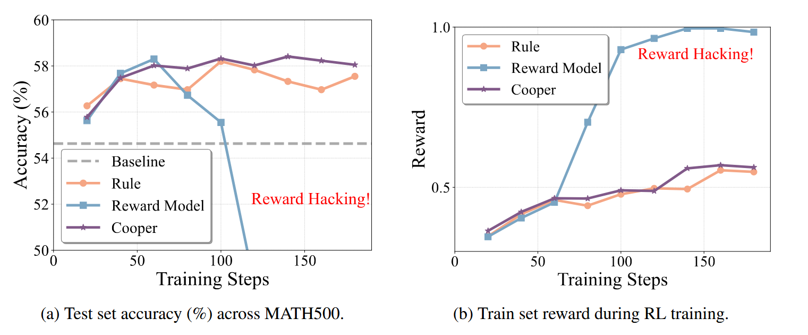

<div align="center">

<h1 style="display: flex; justify-content: center; align-items: center; gap: 10px; margin: 0;">
Cooper: Co-Optimizing Policy and Reward Models in Reinforcement Learning for Large Language Models
</h1>
<p align="center"><em></em></p>

<p><em>A RL framework that jointly optimizes both the policy model and the reward model.</em></p>

[](https://arxiv.org/abs/2508.05613) [](https://www.alphaxiv.org/abs/2508.05613) [](https://github.com/ZJU-REAL/Cooper)
</div>

<br>

<div align="center">
  
  <p><em> An overview of the Cooper training framework. Each training step in Cooper consists of two stages: policy model optimization (blue area) and reward model optimization (green area).</em></p>
</div>

---

## 🎉 News
*   **[2025-8-9]** We release the code and dataset. 
*   **[2025-8-7]** Our paper, **Cooper: Co-Optimizing Policy and Reward Models in Reinforcement Learning for Large Language Models**, is now available on arXiv!


---

## Table of Contents
* [Motivation](#motivation)
* [Highlights](#highlights)
* [Installation](#-installation)
* [Dataset](#-dataset)
* [Quick Start](#-quick-start)
* [Main Result](#-main-result)
* [Citation](#-citation)
* [Acknowledgement](#-acknowledgement)

---
## Motivation
 Existing RL methods face a critical dilemma in reward design:

*   **Rule-based rewards** are precise but brittle. They struggle to parse diverse answer formats, leading to incorrect penalties that stifle model learning.
*   **Model-based rewards** (using a fixed reward model) are more robust but are vulnerable to **reward hacking**. The policy model can learn to exploit loopholes in the reward model, achieving high scores for incorrect answers and causing performance to collapse.

This forces a difficult choice between a reward system that is precise but inflexible, and one that is adaptable but easily exploited. How can we get the best of both worlds?

<div align="center">
  
</div>

This is where **Cooper** comes in. Cooper introduces a framework that **co-optimizes** both the policy and the reward model. It leverages the high precision of rule-based rewards to identify trustworthy positive samples, while an assistant LLM dynamically generates challenging negative samples.  This continuous stream of high-quality preference pairs is used to continuously refine the reward model, making it more robust and resistant to hacking. This dynamic process breaks the static reward dilemma, leading to more **stable** and **robust** RL training.


---
## ✨ Highlights

*   💡 **Co-Optimizing Framework**: Cooper is a novel framework to jointly and dynamically optimize both the policy and reward models during RL, breaking the limitations of static reward functions.
*   🛡️ **Mitigates Reward Hacking**: By continuously updating the reward model with high-quality data, Cooper effectively prevents the policy model from exploiting its weaknesses, ensuring stable and meaningful training.
*   ⚙️ **Dynamic Data Strategy**: Leverages a hybrid approach where high-precision rule-based rewards identify positive samples, and an assistant LLM generates challenging negative samples, constantly improving the reward model's accuracy.
*   🚀 **Improved Performance & Robustness**: Experiments show that Cooper not only alleviates reward hacking but also improves end-to-end performance, achieving a 3.09% gain in average accuracy on Qwen2.5-1.5B-Instruct.
---
## 🛠 Installation
Our framework is built upon **Verl**.

1.  **Create and activate a conda environment:**
    ```bash
    conda create -n Cooper python=3.10
    conda activate Cooper

    # pip install
    pip install torch==2.6.0 

    # install vLLM 0.8.2
    pip install vllm==0.8.2
    ```

2.  **Install dependencies:**
    ```bash
    git clone https://github.com/zju-real/Cooper.git
    cd Cooper
    pip install -e .
    ```
    Please ensure you have a PyTorch version compatible with your CUDA drivers installed.

---
## 📊 Dataset
We provide the dataset for training the VerifyRM in ```
dataset/VerifyRM_training_data.parquet```. This dataset contains 58.7K pairs of questions, answers and completions, with the completetions labeled as either correct(1) or incorrect(0).

---

## 🚀 Quick Start
### VerifyRM Training
For training VerifyRM, please specify the ```model_path``` in ```train_VerifyRM/train.py```. The ```data_path``` is set by default to ```dataset/VerifyRM_training_data.parquet```.

```bash
cd train_VerifyRM
bash run.sh
```
### Cooper Training
To start a training run with Cooper, you can use the provided shell script. For example, to train a 1.5B parameter model on gsm8k :

```bash
bash recipe/cooper/test_qwen2.5-1.5B-Instruct.sh
```
Modify the following configurations in training scripts:

```bash
gsm8k_train_path=/path/to/your/gsm8k/train.parquet
gsm8k_test_path=/path/to/your/gsm8k/test.parquet
model_name_or_path=/path/to/your/qwen2.5-1.5b-instruct
reward_model_path=/path/to/your/reward_model
collaborator_model_path=/path/to/your/assistant_model
```

---
## 📈 Main Result
### Reasoning Performance:
For all evaluations, we use a temperature of 0.7 and top-p of 0.95, generating 8 samples per problem and computing the average accuracy to mitigate evaluation variance.
| **Base Model** | **Reward Type** | **GSM8K** | **SVAMP** | **MATH500** | **OB-EN** | **Odyssey** | **Average** |
|----------------|-----------------|-----------|-----------|-------------|-----------|-------------|-------------|
| **Qwen2.5-1.5B-Instruct** | Baseline | 74.10 | 84.60 | 54.63 | 20.17 | 39.33 | 54.93 |
| | Rule-based | <u>76.44</u> | <u>87.26</u> | <u>57.55</u> | **23.33** | <u>42.83</u> | <u>57.48</u> |
| | Model-based | 30.78 | 72.04 | 29.70 | 1.43 | 11.89 | 38.91 |
| | **Cooper (Ours)** | **77.02** | **87.65** | **58.05** | <u>23.22</u> | **44.17** | **58.02** |
| **Llama-3.2-1B-Instruct** | Baseline | 50.39 | 71.33 | 29.58 | 6.41 | 34.77 | 38.50 |
| | Rule-based | <u>56.56</u> | <u>72.24</u> | <u>34.20</u> | <u>7.95</u> | **40.02** | <u>42.19</u> |
| | Model-based | 36.32 | 59.35 | 20.70 | 0.22 | 7.39 | 24.80 |
| | **Cooper (Ours)** | **57.14** | **73.45** | **34.88** | **8.02** | <u>39.98</u> | **42.69** |


### Training dynamics across RL training steps of Cooper：

<div align="center">
  
  <p><em>Training dynamics across RL training steps of Cooper</em></p>
</div>

---
## 🙏 Acknowledgement

Our RL training code is built upon the excellent [Verl](https://github.com/volcengine/verl) framework. We extend our sincere gratitude to their team for open-sourcing their powerful library.

---
## 📄 Citation

If you find Cooper useful in your research, please consider citing our work:

```bibtex
@misc{hong2025coopercooptimizingpolicyreward,
      title={Cooper: Co-Optimizing Policy and Reward Models in Reinforcement Learning for Large Language Models}, 
      author={Haitao Hong and Yuchen Yan and Xingyu Wu and Guiyang Hou and Wenqi Zhang and Weiming Lu and Yongliang Shen and Jun Xiao},
      year={2025},
      eprint={2508.05613},
      archivePrefix={arXiv},
      primaryClass={cs.CL},
      url={https://arxiv.org/abs/2508.05613}, 
}

```
